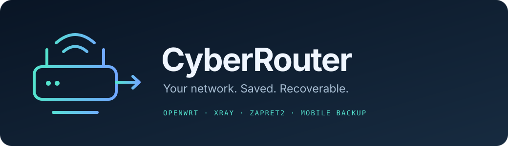

<p align="center"></p>
<h3 align="center">Домашняя сеть, которую можно восстановить</h3>
<p align="center">Полный снимок Flint 2, исходники доработок и проверяемое развёртывание на чистом OpenWrt.</p>
<p align="center">
<a href="https://github.com/edwardgushchin/CyberRouter/actions/workflows/checks.yml"></a>


</p>
<p align="center"><a href="docs/RECOVERY.md">Восстановление</a> · <a href="docs/COMPONENTS.md">Что сохранено</a> · <a href="docs/MIGRATION.md">Другой роутер</a> · <a href="docs/VERIFICATION.md">Проверки</a></p>

## О проекте

CyberRouter сохраняет фактическое состояние домашнего роутера на **9 сентября 2026 года**. Это Git-репозиторий с полным зашифрованным состоянием, официальной прошивкой и читаемым кодом наших доработок. Для восстановления на таком же устройстве не нужны старые чаты, действующий старый роутер или доступ к будущим зеркалам пакетов.

Оформление README и структура документации вдохновлены [SDL3-CS](https://github.com/edwardgushchin/SDL3-CS). Логотип и содержание собственные. Публичный репозиторий: [edwardgushchin/CyberRouter](https://github.com/edwardgushchin/CyberRouter). Автономные проверки выполняет [GitHub Actions](https://github.com/edwardgushchin/CyberRouter/actions/workflows/checks.yml).

## Что внутри

| Область | Сохранено |
| --- | --- |
| Сеть | LAN/WAN/WWAN, Wi-Fi и ключи, DHCP, DNS/DoH, firewall/nftables, IPv4/IPv6, SSH, LuCI |
| Xray | Рабочий профиль и два резерва, watchdog, TProxy/split routing, ручные правила, learner, панели LuCI |
| Автосписки | Re:filter, geosite/geoip, updater, проверка SHA-256, cron, горячее применение маршрутов |
| DPI | Установленный zapret2, его конфигурация, скрипты, списки и автозапуск |
| Мобильный резерв | Выбор WAN/телефона, Wi-Fi, Telemost/WB Stream/VK, router-joiner, авторизация и UI |
| ОС | Все 204 установленных пакета, их бинарники и библиотеки, APK-база, службы и права файлов |
| История | Резервные копии на роутере, защищённые локальные архивы прежних работ и оба локальных дерева исходников |

Секреты, cookies, SSH-ключи и приватные конфигурации находятся **только внутри зашифрованного снимка**. Открытые файлы `components/` пригодны для ревью; полным источником текущего состояния служит `snapshots/`.

## Совместимость

| Сценарий | Поддержка |
| --- | --- |
| Чистый GL.iNet GL-MT6000 / Flint 2 | Точное восстановление на сохранённой OpenWrt 25.12.2, r32802-f505120278, kernel 6.12.74 |
| Тот же Flint 2 после поломки накопителя/сброса | Та же процедура после восстановления загрузки и чистой прошивки |
| Другая модель либо другая версия OpenWrt | Исходники и настройки доступны; сначала адаптация портов, радио, пакетов и архитектуры по [инструкции](docs/MIGRATION.md) |

Проверена реконструкция всех **3 146 записей**, включая **2 341 обычный файл** и **437 ссылок**. Физическая прошивка запасного устройства пока не выполнялась. [Подробности проверок](docs/VERIFICATION.md).

## Быстрый старт

На рабочем компьютере нужны Python 3.12+, GnuPG, OpenSSH, `sha256sum` и Git. Дополнительных Python-пакетов нет. Ключ `private/recovery.key` должен быть получен из отдельной резервной копии и иметь права `0600`.

```bash
python tools/cyberrouter.py open snapshots/2026-09-09 --output private/recovery
python tools/cyberrouter.py prepare private/recovery/capture --output private/prepared-new
python tools/verify-recovery.py private/recovery/capture private/prepared-new
python tools/cyberrouter.py deploy private/prepared-new --target router-replacement
```

Последняя команда только проверяет совместимость. Запись требует `--apply` и допускается только на чистом заменяющем роутере. Сначала прочитайте [пошаговое восстановление](docs/RECOVERY.md), включая прошивку и первый SSH-доступ.

## Структура

```text
assets/       оформление
components/   Xray, мобильный резерв, live-скрипты и закреплённый relay
firmware/     официальная прошивка Flint 2 и контрольная сумма
snapshots/    зашифрованные снимки и открытые отчёты без секретов
tools/        захват, подготовка, проверка и установка
tests/        автономные проверки на искусственных данных
docs/         восстановление, состав, перенос и доказательства
private/      ключи, расшифрованные файлы и рабочие данные; исключено из Git
```

## Обновление снимка и разработка

```bash
python tools/cyberrouter.py capture --target flint2 --output snapshots/YYYY-MM-DD-HHMM
sh tools/test.sh
git diff --check
```

Новый снимок сохраняет всё постоянное состояние роутера. История предыдущих снимков остаётся в Git; дополнительные локальные архивы передаются через `--history`. Первая версия уже содержит весь найденный прежний архив. Код и документацию обновляют вместе с изменениями на роутере: [CONTRIBUTING.md](CONTRIBUTING.md).

## Хранение и лицензии

Для аварии роутера комплект уже находится на компьютере. Для аварии компьютера нужна **ещё одна копия репозитория и отдельная копия ключа на другом носителе**. Две папки на одном диске не дают такой защиты. Утрата ключа делает зашифрованный снимок недоступным.

Инструменты проекта — [zlib](LICENSE); сторонние компоненты сохраняют свои лицензии, см. [THIRD_PARTY_NOTICES.md](THIRD_PARTY_NOTICES.md). Снимок опубликован в зашифрованном виде; его ключ и расшифрованное содержимое остаются приватными.
